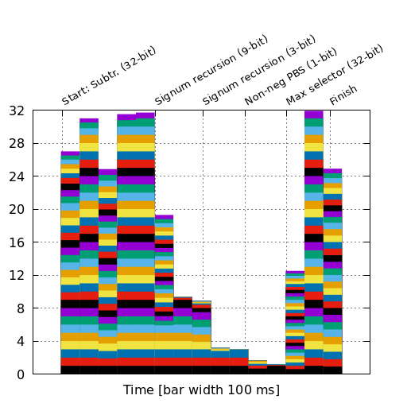

# Parmesan

*Parallel ARithMEticS over ENcrypted data*

Parmesan implements selected parallel algorithms for multi-digit arithmetics over TFHE ciphertexts. Namely:

- addition/subtraction,
- scalar multiplication (i.e., multiplication by a known integer),
- multiplication,
- squaring,
- signum,
- maximum of two numbers,
- rounding, and
- evaluation of a simple neural network.

*Disclaimer: Parmesan is currently an experimental library, which serves as a proof-of-concept for parallelizable arithmetics over encrypted data. Hence neither correct functionality nor any level of code quality is guaranteed.*


## The Short Story

In the standard integer representation, parallel addition is not possible due to the carry, which can propagate all the way from the LSB to the MSB.
However, using, e.g., an alphabet `{-1,0,1}` for base-2 integer representation, a parallel addition algorithm *does* exist.
Other operations like (scalar) multiplication and squaring benefit from the fast addition, too.


## The Long Story

See our [full paper on eprint](https://eprint.iacr.org/2023/544) and our preceeding [study](https://dl.acm.org/doi/10.1145/3508398.3511527) that compares various approaches for parallel addition (also on [eprint](https://eprint.iacr.org/2022/067)).


## Use `parmesan`

Add a dependency to your `Cargo.toml` file in your Rust project.

```toml
[dependencies]
parmesan = { version = "^0.0.20-alpha", features = ["measure"] }
colored = "^2.0.0"
```

For the best performance, compile with
```shell
$ RUSTFLAGS="-C target-cpu=native" cargo build --release
```


## Example

```rust
use std::error::Error;

use colored::Colorize;

use parmesan::params;
use parmesan::userovo::*;
use parmesan::ParmesanUserovo;
use parmesan::ParmesanCloudovo;
use parmesan::arithmetics::ParmArithmetics;

pub fn main() -> Result<(), Box<dyn Error>> {

    // =================================
    //  Initialization
    // ---------------------------------
    //  Global Scope
    let par = &params::PAR_CNCR_V0_2__M2_C3;

    // ---------------------------------
    //  Userovo Scope
    let pu = ParmesanUserovo::new(par)?;
    let pub_k = pu.export_pub_keys();
    // ---------------------------------
    //  Cloudovo Scope
    let pc = ParmesanCloudovo::new(par, &pub_k);

    // =================================
    //  U: Encryption
    let a: Vec<i32> = vec![1,0,1,-1,-1,0,-1,1,1,-1,1,1,1,-1,-1,0,0,1,1,0,0,0,0,-1,0,0,0,0,0,-1,0,0,];
    let b: Vec<i32> = vec![-1,0,0,-1,1,1,-1,1,-1,0,0,1,0,1,1,0,0,0,-1,0,0,1,0,0,-1,0,-1,-1,-1,1,1,0,];
    let ca = pu.encrypt_vec(&a)?;
    let cb = pu.encrypt_vec(&b)?;
    // convert to actual numbers
    let a_val = encryption::convert_from_vec(&a)?;
    let b_val = encryption::convert_from_vec(&b)?;
    // print plain inputs
    println!("\nInputs:\n");
    println!("a   = {:12}", a_val);
    println!("b   = {:12}", b_val);

    // =================================
    //  C: Evaluation
    let c_add_a_b = ParmArithmetics::add(&pc, &ca, &cb);

    // =================================
    //  U: Decryption
    let add_a_b = pu.decrypt(&c_add_a_b)?;

    let mut summary_text = format!("\nResults:\n");
    summary_text = format!("{}\nAddition:", summary_text);
    summary_text = format!("{}\na + b         = {:12} :: {} (exp. {})", summary_text,
                            add_a_b,
                            if add_a_b == a_val + b_val {String::from("PASS").bold().green()} else {String::from("FAIL").bold().red()},
                            a_val + b_val
    );

    println!("{}", summary_text);

    println!("\nDemo END\n");

    Ok(())
}
```


## Benchmarks

For benchmarks, we implement an experimental tool [bench-parmesan](https://github.com/fakub/bench-parmesan), which also compares Parmesan and Concrete `v0.2`.
Results can be found in the [whitepaper](https://eprint.iacr.org/2023/544).

### Processor Load

In particular, we measure the processor load; in the graph below, find our results for 32-bit maximum that were measured on a machine with AMD EPYC 7543.



An extra graph that shows the processor load during 32-bit multiplication can be found [here](docs/mul32.pdf).


## License

Parmesan is licensed under AGPLv3.


## Acknowledgments

This work was supported by the MESRI-BMBF French-German joint project UPCARE (ANR-20-CYAL-0003-01), granted to [EURECOM](https://www.eurecom.fr/).


Computational resources were supplied by the project [e-Infrastruktura CZ](https://www.cesnet.cz/projekty/e-infra_cz/) (e-INFRA CZ LM2018140) supported by the Ministry of Education, Youth and Sports of the Czech Republic.


